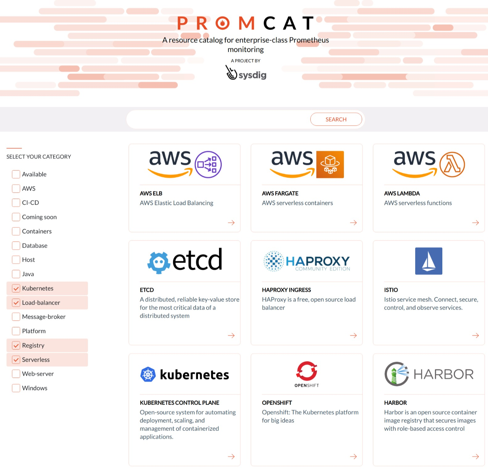

A resource catalog for enterprise-class Prometheus monitoring 
 

# What is PromCat
Promcat is a project maintained by [Sysdig](http://sysdig.com) that offers a curated catalog of setup guides, dashboards and alerts fully compatible with [Prometheus](https://prometheus.io/) and covering how to monitor the most important cloud native technologies. 

You can find all the content organized and ready to use in [promcat.io](https://promcat.io). Alternatively, feel free to explore the [resources folder of this repository](resources) for the raw files and content.

# What can I find?
PromCat comes as a crossroad for anyone that is looking for how to monitor a cloud application either with Prometheus or with Sysdig Monitor. 

Here you will find the following contents for each application: 
* Setup Guides: A complete step-by-step guide to install and configure the Prometheus exporter or the metrics module of the application.
* Dashboards: A set of dashboards to monitor for trouble-shooting and metrics exploration of the application. All dashboards are offered in both [Sysdig Monitor](https://sysdig.com/products/monitor/) and [Grafana](https://github.com/grafana/grafana) formats.
* Alerts: A set of curated alerts for the application.
* Recording Rules: A set of recording rules.

# Who can use the resources?
PromCat has two main use cases:
* Sysdig customers: As a Sysdig customer, in PromCat you will find all the resources needed to setup  exporters to be scraped by the Sysdig Agent and a set of ready to use dashboards and alerts.
* Any Prometheus user: Thanks to the [native compatibility of the Sysdig Agent with Prometheus](https://sysdig.com/opensource/prometheus/), the same setup guides, dashboards and alerts can be used by any Prometheus user that needs to monitor cloud applications.

# Contributing
As any open source project, all contributions are welcome. 

You can contribute by:
* Opening issues in this repository
* Clone the repository and submit a pull request
* Participate in the #promcat channel of the [Sysdig public slack](http://sysdig.slack.com)

As the main objective of PromCat is to offer high quality resources for professional users, all contributions will be review and tested before merging to mainstream by the maintainers.

# Attributions
Most of the resources that you can find in PromCat are made and maintained by [Sysdig](http://sysdig.com). You can check [MAINTAINERS.md](MAINTAINERS.md) for more information.

However, each of the Prometheus exporters and other open source resources that are used, are attributed and referenced in each application folder. If you find any attribution or reference that can be improved or edited, you can open an issue in the repository, make a pull request to this repository or contact us via the #promcat channel of the [Sysdig public slack](sysdig.slack.com).